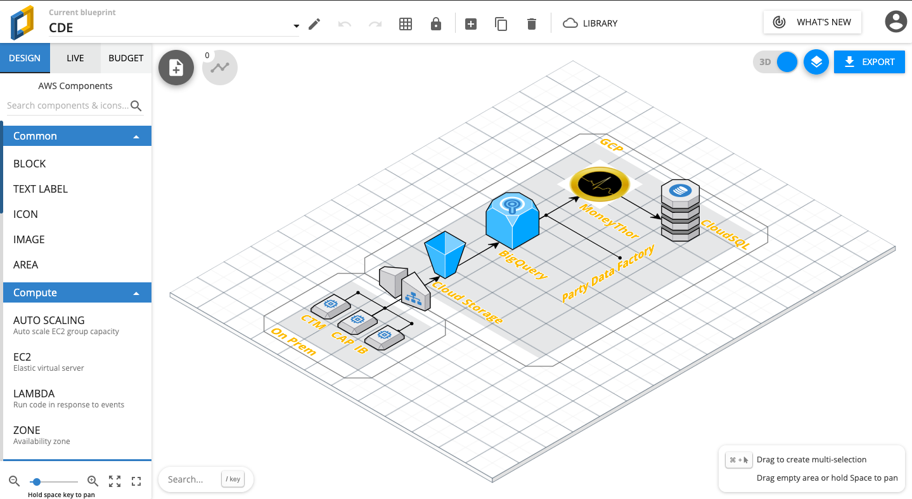

# gcpcraft-io

## Narrative
Intended to be a complete clone of cloudcraft.co, but for GCP.

## Features
- 1.0. Canvas 
    - 1.1. All GCP icons created as per https://cloud.google.com/icons/ available via left-hand of screen
    - 1.2. Icons to be dragged and dropped onto main canvas on right of screen

 - 2.0. Terraform
    - 2.1. Once GCP design on Canvas is fianlised, a button-click will export the design in to Terraform code

## Tech
 - https://svelte.dev/